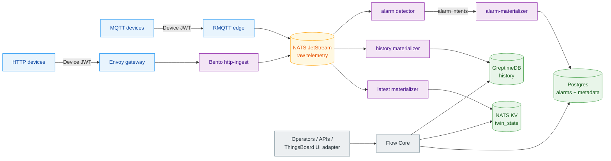

# ThingsFlow

[](https://github.com/lirei-lab/thingsflow/actions/workflows/test-flow-core.yml)
[](https://github.com/lirei-lab/thingsflow/actions/workflows/oss-release-gate.yml)
[](https://github.com/lirei-lab/thingsflow/actions/workflows/docs.yml)
[](LICENSE)
[](https://github.com/orgs/lirei-lab/packages)

Open industrial IoT middleware for event-driven telemetry, digital twins,
data-plane alarms, and optional ThingsBoard UI compatibility.

**Documentation: <https://lirei.ca/thingsflow/>** — architecture, install,
operations, security posture and benchmark methodology.
[Roadmap](docs/ROADMAP.md) — which storage and streaming backends are supported
today, and which are planned.

ThingsFlow is not a ThingsBoard distribution and not a JVM runtime repackaging. It
is an independent IoT middleware architecture: **Flow Core** provides the
API-first control plane, while the data plane moves device data through a
NATS-first data plane built from RMQTT, Envoy, Bento, NATS, GreptimeDB, and
NATS KV. The ThingsBoard web UI is kept as an optional operator console and device
management surface, adapted through Flow Core rather than through the original
ThingsBoard backend.

The design is similar in spirit to platforms such as Mainflux: self-hosted,
message-oriented IoT middleware with clear boundaries between connectivity,
identity, storage, and APIs. ThingsFlow adds a pragmatic bridge for teams that want
the mature ThingsBoard UI and device-management workflows while replacing the
hot telemetry path with smaller, standard OSS components.

## Architecture In One Page



Flow Core is not in the telemetry hot path. It owns identity, provisioning,
device management, credentials, topology, dashboards, audit, alarm APIs,
ThingsBoard-compatible REST/WebSocket surfaces, and twin reads. Device telemetry
enters through edge services and is materialized by Bento/NATS components.

## Screenshots

Live telemetry from the demo simulator, rendered by the optional ThingsBoard UI
over Flow Core APIs (data path: device → NATS JetStream → GreptimeDB → charts):


More captures — [device list](docs/assets/screenshots/devices.png) and the
[smart-building demo dashboard](docs/assets/screenshots/dashboard-smart-building.png).

## Why NATS Is Central

NATS is the native event boundary for ThingsFlow:

- **JetStream** carries accepted raw telemetry from MQTT and HTTP edges.
- **NATS KV** is the authoritative hot-state store for latest telemetry and
  twin state used by dashboard hydration and twin reads.
- Independent consumers can materialize history, alarms, derived events,
  integrations, and future ML features without changing Flow Core.
- NATS makes the broker choice explicit and compact: the public runtime is
  NATS-first, with no parallel broker chain in the default deployment.

This keeps Postgres out of the telemetry hot path entirely: it stays focused on
operational state, alarms, metadata, and audit, and holds no latest-telemetry table.
GreptimeDB stores historical time series by default; QuestDB remains an optional backend.

**What this does *not* do is remove the latest-value bottleneck — it relocates it.**
Measured on a 16-core node (`benchmarks/FINDING-twin-state.md`): the history path
sustains ≥16,000 msg/s with zero loss, while the NATS KV latest-value writer saturates
around **3,900 msg/s** and then *degrades* under further load. Above that rate the stored
history stays complete and correct, but the "current value" a dashboard reads falls
behind. The cause is not yet identified and no fix has been applied. Anyone sizing a
deployment on the latest-value path should use that number, not the ingest number.

## Minimal Custom Code In The Main Flow

The main telemetry path deliberately uses standard components:

| Concern | Primary component |
|---|---|
| MQTT broker and device sessions | RMQTT |
| HTTP JWT gateway | Envoy |
| HTTP normalization and data-plane processing | Bento |
| Event bus and replay boundary | NATS JetStream |
| Latest/twin hot state | NATS KV |
| Historical telemetry | GreptimeDB |
| Operational metadata and alarms | Postgres |
| Control plane and UI compatibility | Flow Core |

Custom code is concentrated where it adds product value: API compatibility,
device provisioning, topology, security policy, dashboard compatibility, twin
reads, and alarm lifecycle materialization. The ingest path itself is an effort
to standardize IoT middleware around interoperability, security, scaling,
observability, and replaceable OSS building blocks.

## Module Map

```text
flow-core/            Flow Core: Go control plane and compatibility API.
docker/               Local NATS-first compose stack and edge configs.
k8s/helm/thingsflow/  Public Helm chart for the NATS-first runtime.
sdk/python/           Device SDK (thingsflow_device_sdk).
docs/                 Architecture, roadmap, security, install, operations, release.
benchmarks/           Reproducible benchmark scenarios and evidence.
tools/                Verification, release-gate, and maintenance scripts.
```

## Optional ThingsBoard UI Adapter

The upstream ThingsBoard Angular UI can be used as an operator console. Flow Core
implements the subset of REST/WebSocket/device-management contracts needed by
dashboards, assets, devices, alarms, users, resources, provisioning, and
selected compatibility workflows.

ThingsBoard does not provide the platform core:

- no `tb-node`;
- no `tb-rule-engine`;
- no `tb-mqtt-transport`;
- no JVM hot path;
- no requirement to use the UI for provisioning or operation.

Custom portals, CLIs, provisioning systems, and automation can use Flow Core APIs
directly.

### How compatibility is verified

UI compatibility is not aspirational: every endpoint the ThingsBoard UI bundle
calls is extracted into a machine-readable contract
([flow-core/internal/uicontract](flow-core/internal/uicontract)) that declares
each one as implemented or explicitly out of scope. A gate
(`flow-core/cmd/ui-contract-check`) replays all of them against a running
deployment; anything undeclared answers a loud 404 instead of a silent empty
page. Coverage details live in
[docs/UI_CONTRACT_COVERAGE.md](docs/UI_CONTRACT_COVERAGE.md).

## Operational Identifiers

The public product name is **ThingsFlow**. Runtime identifiers now use the same
family of names across clusters, images, imports, MQTT ACLs, and CI workflows:

- Helm chart, release, namespace, and Secret examples: `thingsflow`;
- Go service directory and Docker image component: `flow-core`;
- Python compatibility import: `thingsflow_device_sdk`;
- MQTT topic namespace: `thingsflow/devices/{mqttIdentity}/...`;
- selected environment variables and metrics with `FLOW_*` / `flow_*` prefixes.

New user-facing docs and SDK examples should say ThingsFlow and use
`thingsflow_device_sdk`.

## Security Model

ThingsFlow separates human/API security from device-edge security:

- Browser/API users authenticate to Flow Core with platform JWTs and optional OIDC.
- MQTT devices use provisioning-issued ES256 Device JWTs validated by RMQTT;
  the broker pins the MQTT Client ID to the token and the ACL scopes each device
  to its own topic, so one device cannot publish as another.
- HTTP telemetry devices use the same Device JWTs validated by Envoy JWKS.
- Device telemetry does not grant access to Flow Core APIs.
- Public UI/API ingress, MQTT exposure, and HTTP telemetry exposure are
  configured separately; the MQTT edge can publish over TLS on 8883 (`rmqttEdge.tls` — the chart default is an internal plaintext 1883 listener).
- Device JWTs are short-lived bearer tokens: there is no per-message revocation
  check at the edge, so the TTL is the revocation window.
- Production installs must pin signing keys, use TLS for exposed edges, and keep
  raw telemetry payloads and tokens out of logs.

See [docs/SECURITY.md](docs/SECURITY.md) for the threat model and
[docs/MQTT_DEVICE_AUTH.md](docs/MQTT_DEVICE_AUTH.md) for the device-side contract.

## Quick Start

Local NATS-first stack:

```bash
docker compose -f docker/docker-compose-nats.yml up -d \
  postgres greptimedb nats nats-bootstrap flow-core rmqtt-edge \
  http-ingest-bento http-ingest nats-latest-kv nats-greptimedb \
  nats-alarms alarm-materializer
```

Kubernetes:

```bash
helm install thingsflow ./k8s/helm/thingsflow -n thingsflow --create-namespace
KUBECONFIG=/path/to/kubeconfig tools/verify-platform-health.sh
```

Local development credentials (the compose stack mounts the demo-password
seed, so these work out of the box):

```text
sysadmin@thingsboard.org / sysadmin
tenant@thingsboard.org   / tenant
```

These known passwords are **demo-only**. A Kubernetes install seeds the
accounts with a per-install *random* password (no known login) unless you opt
into demo mode with `--set flowCore.loadDemo=true`; `helm` refuses to render a
`production` install with `loadDemo=true`. Never expose a stack that still has
the demo passwords — reset them first.

## Documentation

The documentation is organized around the same practical shape used by modular
IoT middleware projects: overview, getting started, architecture, messaging,
provisioning/API, security, operations, and release gates.

- Start at [docs/index.md](docs/index.md) for the public map.
- Run the stack with [docs/GETTING_STARTED.md](docs/GETTING_STARTED.md) and
  [docs/INSTALL.md](docs/INSTALL.md).
- Understand the platform through [docs/ARCHITECTURE.md](docs/ARCHITECTURE.md),
  [docs/DIGITAL_TWIN.md](docs/DIGITAL_TWIN.md), and
  [docs/DATA_PLANE.md](docs/DATA_PLANE.md).
- Integrate through [docs/API_REFERENCE.md](docs/API_REFERENCE.md).
- Connect devices with [docs/MQTT_DEVICE_AUTH.md](docs/MQTT_DEVICE_AUTH.md) and
  [docs/DEVICE_SDK.md](docs/DEVICE_SDK.md).
- Secure and operate with [docs/SECURITY.md](docs/SECURITY.md) and
  [docs/OPERATIONS.md](docs/OPERATIONS.md).
- Validate demos and release gates with
  [docs/DEMO_PROFILE.md](docs/DEMO_PROFILE.md) and
  [docs/RELEASE.md](docs/RELEASE.md).

## Status

ThingsFlow is an open-source release candidate for controlled industrial pilots.
The release boundary is documented in [docs/RELEASE.md](docs/RELEASE.md).

## Contributing

See [CONTRIBUTING.md](CONTRIBUTING.md) for the build/test gates, routing rules,
and project conventions, and [SECURITY.md](SECURITY.md) for how to report
vulnerabilities privately.

## License And Heritage

ThingsFlow is released under the Apache License, Version 2.0. It contains
independently written runtime components and selected Apache-2.0-compatible
material derived from or interoperating with ThingsBoard Community Edition.
References to ThingsBoard describe compatibility only; the "ThingsBoard" name
and logo are trademarks of ThingsBoard, Inc.
