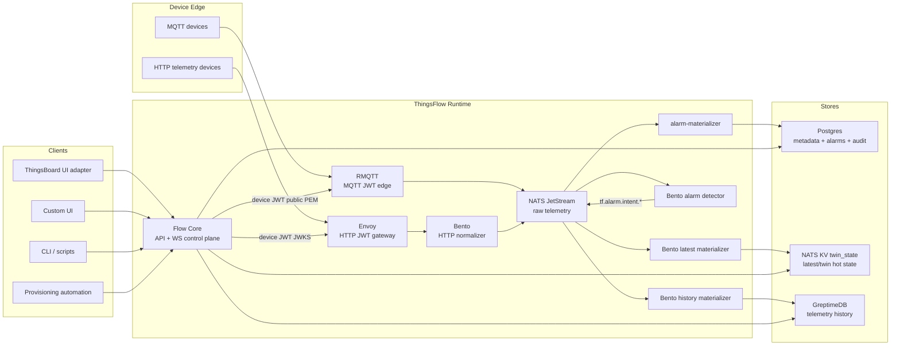
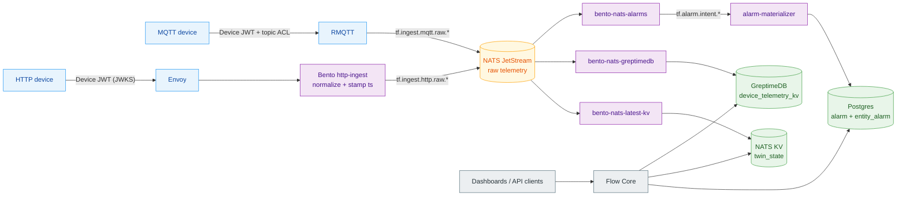

# ThingsFlow Architecture

ThingsFlow is an industrial IoT middleware platform for event-driven telemetry,
digital twins, data-plane alarms, and optional ThingsBoard UI compatibility.
Its default runtime is **NATS-first**: devices publish into NATS through
standard edge components, Bento materializes data, NATS KV carries hot twin
state, GreptimeDB carries telemetry history by default, and Flow Core serves the
control plane and UI-compatible read APIs.

ThingsFlow is similar in spirit to Mainflux and other OSS IoT middleware projects:
it separates connectivity, identity, message flow, storage, and management APIs.
The difference is practical product shape. ThingsFlow keeps the useful
ThingsBoard-style operator console and device-management vocabulary, but adapts
them through Flow Core instead of running the original ThingsBoard JVM backend.

## Design Position

Mainflux-style middleware documentation usually starts from a small set of
stable platform concepts: users, devices/things, credentials, messaging,
provisioning, storage, adapters, and security. ThingsFlow keeps that modularity,
but centers the runtime on four decisions that are specific to this project:

- **NATS is both event bus and hot-state boundary.** JetStream carries
  accepted telemetry and NATS KV carries latest/twin state.
- **The ThingsBoard UI is a client, not the platform core.** Flow Core adapts
  the contracts needed by dashboards and device operations.
- **Bento is the default processor layer.** Normalization, materialization, and
  simple alarm detection are declarative where possible.
- **Storage is split by workload.** Postgres owns operational state, GreptimeDB
  owns history by default, and NATS KV owns latest/twin hot state.

## Comparative Positioning

ThingsFlow is not a clone of one existing platform. It combines a few proven IoT
patterns into a smaller runtime boundary.

| Platform | Strong idea | ThingsFlow relationship |
|---|---|---|
| Eclipse Ditto | Digital twins as a device abstraction with synchronous/asynchronous APIs, state management, connections, and resource-based access control. | ThingsFlow adopts the `Thing`/feature/relation direction and keeps the door open for desired/reported state, but uses NATS KV for hot twin state and keeps ThingsBoard UI compatibility. |
| ThingsBoard | Mature operator UI, dashboards, widgets, alarms, device management, and broad protocol support. | ThingsFlow keeps the useful UI and API shapes, but replaces the ThingsBoard JVM ingest/rule-engine path with RMQTT, NATS, Bento, GreptimeDB by default, and a Go control plane. QuestDB is optional. |
| Mainflux/Magistrala | Modular IoT middleware: auth, things, adapters, messaging, storage, alarms, notifiers, and clear service boundaries. | ThingsFlow follows the modular philosophy, but minimizes custom services by using standard components for the main telemetry flow. |
| OpenRemote | Asset/context model, configurable manager UI, agents/protocols, rules, and application-oriented asset dashboards. | ThingsFlow has a similar asset/twin ambition, but is more event-stream oriented and treats NATS as the integration boundary. |
| Astarte | Strong data contracts through interfaces, explicit datastream vs property semantics, device SDKs, triggers, and Kubernetes-first operations. | ThingsFlow has a similar split between telemetry history and latest state, but still needs a stronger interface/schema layer for production data governance. |

The practical value proposition is:

- **ThingsBoard-like operator experience without the ThingsBoard hot path.**
- **Mainflux-like modularity with fewer custom runtime services.**
- **Ditto-like twin direction with NATS KV as the fast current-state store.**
- **Astarte-like separation between streams and state, but without forcing a
  strict interface model on day one.**
- **OpenRemote-like assets/topology direction, but centered on event streaming
  and high-volume telemetry.**

## Known Gaps And Improvement Plan

These are the areas where ThingsFlow should deliberately improve before a broad
production release.

| Area | Current gap | Improvement path |
|---|---|---|
| Twin policy model | `policyId` is stable metadata, not yet a fully enforced fine-grained policy document. | Add policy documents, per-feature read/write checks, and audited twin write operations before enabling desired state writes. |
| Desired/reported state | Current twin features focus on latest telemetry and read projection. | Add desired/reported state topics and API contracts with NATS-backed change events and explicit conflict/version semantics. |
| Interface/schema governance | Telemetry keys are flexible, but not yet governed like Astarte interfaces. | Add optional model/interface definitions in `twin_model`, validate device payloads at Bento or an attached processor, and expose schema drift reports. |
| Rules and automations | Alarm detection is intentionally small and data-plane based; there is no full visual rule editor. | Keep simple alarms in Bento, add reusable processor templates, and use downstream NATS processors for ML, enrichment, and workflow integrations. |
| Multi-protocol breadth | MQTT and HTTP are the first-class paths. | Add protocols only through edge adapters that publish the same NATS event contract, instead of expanding Flow Core. |
| Multi-tenant fairness | Current gates check functional isolation and resource posture, but tenant-level quotas need hardening. | Add per-tenant/device rate limits at RMQTT/Envoy, NATS subject/account boundaries, and dashboard/API throttles. |
| High availability | Single-node RMQTT, NATS, Postgres, and GreptimeDB defaults are good for pilots, not full HA. | Provide production overlays for NATS persistence/replicas, external Postgres, GreptimeDB object storage/cluster strategy, RMQTT cluster mode, and pod disruption budgets. |
| Benchmark evidence | The methodology exists; public comparative result tables should be filled only with repeatable runs. | Run the benchmark matrix against fresh ThingsFlow and ThingsBoard Classic namespaces, publish sanitized results, and keep raw cluster details outside the public repo. |

## Architectural Principles

- **NATS is the event spine.** JetStream is the native telemetry stream and
  NATS KV is the authoritative latest/twin hot-state store.
- **Flow Core is not in telemetry ingest.** It handles auth, provisioning,
  device management, topology, alarms API, dashboards, audit, and read
  compatibility.
- **Bento is the processor layer.** Bento normalizes HTTP telemetry, writes
  latest values, writes history, detects alarm intents, and leaves room for
  future enrichments with minimal custom code.
- **Postgres is operational state.** Users, tenants, devices, credentials,
  topology, dashboards, alarm lifecycle, audit, and snapshots live in Postgres.
  It is not the hot latest telemetry sink.
- **GreptimeDB is telemetry history by default.** Time-series writes and
  time-window reads live outside Postgres. Set `timeseries.store=questdb` to
  use the optional QuestDB backend.
- **GreptimeDB is the cloud-storage direction.** Production overlays should
  use GreptimeDB object storage for historical telemetry durability instead of
  treating the history PVC as the long-term system of record.
- **ThingsBoard UI is optional.** It is a compatibility client over Flow Core,
  not the core platform.
- **One default data plane.** The public runtime is RMQTT/HTTP to NATS, then
  Bento to NATS KV, GreptimeDB, and alarm intents. QuestDB is an explicit
  optional backend, not a parallel default path.

## Product Vocabulary

| Module | Role |
|---|---|
| **Flow Core** | Go control plane and compatibility API: auth, provisioning, devices, credentials, topology, dashboards, alarms API, audit, twin reads, REST/WS. |
| **ThingsFlow data plane** | Native data plane: RMQTT, Envoy, Bento, NATS JetStream, NATS KV, GreptimeDB by default, optional QuestDB, and alarm intents. |
| **Things** | Digital twin representation of devices/assets with identity, attributes, features, topology, and latest state. |
| **ThingsBoard UI adapter** | Optional operator console using selected upstream UI and API contracts. |

## Platform Map



## Main Data Flow



This path introduces little custom code in the high-volume flow. The custom
parts are deliberately narrow: Flow Core for control-plane compatibility and
`alarm-materializer` for alarm lifecycle semantics that belong in Postgres
(ack, clear, comments, assignments, and ThingsBoard-compatible alarm queries).

## Bento Integration

Bento is the main flow processor because it gives ThingsFlow declarative pipelines
without writing custom services for every routing, mapping, or threshold
condition.
The default runtime uses Bento to normalize HTTP telemetry into the same event
stream as MQTT, to write compact latest values into NATS KV, to persist history
into GreptimeDB, and to emit alarm intents from simple threshold conditions.
Every consumer attaches to a durable JetStream consumer, so a reconnect replays
the backlog rather than dropping it. The authoritative per-pipeline table —
file, stream, durable and output — is in
[Bento Pipelines](DATA_PLANE.md#bento-pipelines).

Bento is intentionally not the alarm lifecycle database. It detects conditions
and emits intent events. `alarm-materializer` owns the lifecycle write to
Postgres because the UI needs stable alarm IDs, acknowledgement state, clear
state, comments, assignment, and tenant-scoped queries.

## NATS Responsibilities

NATS is not just a queue. It is the interoperability boundary:

- `tf.ingest.mqtt.raw.events` receives accepted MQTT records from RMQTT.
- `tf.ingest.http.raw.events` receives accepted HTTP records
  from Bento after Envoy JWT verification.
- Stream `TF_RAW` captures both device subjects; `TF_ENTITY` captures
  `tf.entity.telemetry.raw.events` for non-device telemetry.
- Processors read through durable consumers on those streams rather than
  subscribing to the subjects directly.
- `tf.alarm.intent.>` carries alarm create/update/clear intents.
- KV bucket `twin_state` stores latest/twin hot state; entries carry a TTL
  (1h by default, 24h on the cluster overlay), so a device that stops
  publishing eventually has no latest value.

Processors can be scaled independently and attached without changing device
edges or Flow Core. This is the reason ThingsFlow can add processors for alarms,
derived metrics, integrations, and ML scoring later without making Postgres or
Flow Core the telemetry bottleneck.

## Twin State

NATS KV is the authoritative hot-state store for latest telemetry and current
twin features in the NATS event plane. Keys follow:

```text
DEVICE.{tenantId}.{deviceId}.telemetry.{key}
```

Values are compact JSON:

```json
{"ts":1778692040123,"value":22.4}
```

Flow Core reads this bucket to hydrate ThingsBoard-compatible latest telemetry,
WebSocket subscriptions, entity lists, and the native twin API. Postgres may
receive eventual snapshots/backups, but it is not the source of truth for hot
latest values.

## Security Boundaries

ThingsFlow separates user/API security from device-edge security:

- Browser/API users authenticate to Flow Core with platform JWTs and optional OIDC.
- MQTT devices use provisioning-issued ES256 Device JWTs validated by RMQTT.
- HTTP telemetry devices use the same Device JWTs validated by Envoy with JWKS.
- Internal NATS clients use deployment credentials and should be restricted by
  subject/account permissions in hardened environments.
- Device telemetry credentials do not grant access to Flow Core APIs.
- Public browser/API ingress, MQTT exposure, and HTTP telemetry exposure are
  configured separately.
- Production deployments must pin signing keys, use TLS or mTLS for exposed
  device edges, and avoid logging telemetry payloads or bearer tokens.

Flow Core publishes the device JWT public verifier:

```text
/api/noauth/device-jwt-public.pem
/.well-known/thingsflow-device-public.pem
/api/noauth/device-jwks
```

RMQTT and Envoy cache these verifiers so normal telemetry does not call Flow Core
per message.

Key custody is handled at the Kubernetes boundary. Production overlays should
reference existing Secrets for `JWT_TOKEN_SIGNING_KEY` and
`DEVICE_JWT_ES256_PRIVATE_KEY_PEM_B64`, and may enable built-in NATS auth with
`nats.auth.existingSecret`. Flow Core can also publish previous public JWKs
through `DEVICE_JWT_ADDITIONAL_PUBLIC_JWKS_B64` for HTTP/JWKS rotation overlap.
The RMQTT NATS bridge config is rendered at pod startup from Secret-backed
environment variables, so NATS credentials do not land in the bridge ConfigMap.
This keeps private material out of public values files and Helm chart defaults.

## ThingsBoard UI Boundary

ThingsBoard survives as a useful compatibility layer:

- dashboards, widgets, resources, SCADA symbols, and system images are seeded;
- REST and WebSocket shapes are implemented where the UI needs them;
- device/entity/alarm/dashboard APIs are adapted by Flow Core;
- classic relation shapes remain available at the boundary.

ThingsBoard does not provide the runtime core:

- no `tb-node`;
- no `tb-rule-engine`;
- no `tb-mqtt-transport`;
- no JVM hot path;
- no requirement that operators use the UI.

The UI is therefore replaceable. A custom portal or automation service can use
Flow Core APIs directly and still rely on the same NATS/GreptimeDB/twin-state data
plane.

## Storage Ownership

| Data | Source of truth | Notes |
|---|---|---|
| Users, tenants, customers | Postgres | Operational identity. |
| Devices, credentials, provisioning | Postgres | Flow Core owns lifecycle and audit. |
| Dashboards, widgets, resources | Postgres | ThingsBoard UI compatibility metadata. |
| Topology | Postgres `topology_edge` plus compatibility `relation` | Governed industrial topology. |
| Latest telemetry and hot twin state | NATS KV `twin_state` | Authoritative hot state for UI hydration and twins. |
| Historical telemetry | GreptimeDB by default, QuestDB optional | High-volume time-series storage. |
| Raw telemetry events | NATS JetStream | Replay and fan-out boundary. |
| Alarm lifecycle | Postgres `alarm`, `entity_alarm`, comments | Dashboard-compatible operational state. |

## Robustness And Scaling

- Edge authentication happens before telemetry enters NATS.
- NATS processors scale independently by subject/queue group.
- Latest, history, and alarms are separate consumers, so history backpressure
  does not block UI latest-state hydration.
- GreptimeDB retention and object-storage lifecycle control telemetry history retention; QuestDB TTL applies only when the optional QuestDB backend is selected.
- Postgres retention controls audit and alarm history.
- Kubernetes readiness gates Flow Core, RMQTT, NATS processors, GreptimeDB, and
  Postgres independently.
- Benchmarks and pilots should measure NATS consumer lag, GreptimeDB write
  latency, NATS KV freshness, alarm materializer lag, and dashboard hydration.

## Verification Boundary

The current release gates focus on:

- local NATS compose smoke;
- Helm render/install of the NATS-first chart;
- RMQTT to NATS telemetry;
- HTTP ingest through Envoy+Bento to NATS;
- GreptimeDB history writes;
- NATS KV latest/twin state;
- alarm intents materialized into dashboard-visible alarms;
- ThingsBoard UI compatibility contracts;
- device security and OIDC controls.

See [GETTING_STARTED.md](GETTING_STARTED.md), [SECURITY.md](SECURITY.md),
[DATA_PLANE.md](DATA_PLANE.md), [OPERATIONS.md](OPERATIONS.md), and
[RELEASE.md](RELEASE.md).
