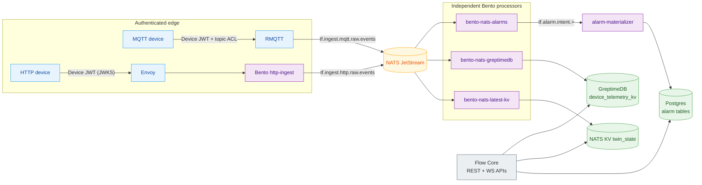

# Data Plane

The data plane is the native telemetry path. It accepts MQTT and HTTP
device telemetry, authenticates it at the edge, publishes accepted events to
NATS, and lets independent Bento processors materialize latest state, history,
and alarm intents. Flow Core stays out of the telemetry hot path.

## Runtime Path



Flow Core never sits between a device and a store: it reads what the
processors materialize and serves it through ThingsBoard UI compatibility APIs and
native APIs.

## Why Flow Core Is Not In Ingest

Flow Core is required for provisioning, credential lifecycle, JWT verifier
publication, dashboards, alarms API, audit, topology, and UI/API reads. It is
not required for every telemetry message after RMQTT or Envoy has a cached
verifier. This keeps high-volume device traffic away from request handlers,
Postgres latest-value writes, and the optional ThingsBoard UI.

The split gives ThingsFlow these operational properties:

- telemetry does not depend on the UI;
- telemetry does not depend on Flow Core request handlers;
- latest values do not overload Postgres;
- processors can be added by subscribing to NATS;
- future integrations, derived metrics, and ML scoring can attach without
  changing device edges.

## MQTT Edge

RMQTT is the principal MQTT device edge. Native devices connect with the
provisioning-issued ES256 device JWT as the MQTT username and publish to:

```text
thingsflow/devices/{mqttIdentity}/telemetry
thingsflow/devices/{mqttIdentity}/attributes
```

RMQTT validates issuer, audience, expiry, signature, and ACL. The
`mqttIdentity` in the topic must match the verified Device JWT. Accepted
messages are bridged to NATS on `tf.ingest.mqtt.raw.events`.

Flow Core stays out of the telemetry hot path, while ThingsBoard UI
compatibility APIs continue to read materialized state through Flow Core.

Before this publish path starts, the device obtains `deviceJwt.token` from
`POST /api/v1/provision` or from an authenticated fleet/control-plane renewal
through `POST /api/device/{deviceId}/jwt`. Provisioning and renewal happen in
Flow Core; normal telemetry publishing does not.

## HTTP Edge

Native HTTP telemetry uses the same Device JWT:

```text
POST /api/v1/telemetry
Authorization: Bearer <deviceJwt.token>
Content-Type: application/json
```

Envoy validates the bearer token with Flow Core JWKS, copies trusted claims to
internal headers, and forwards the request to Bento `http-ingest`. Bento
normalizes the payload and publishes to:

```text
tf.ingest.http.raw.events
```

The device does not choose tenant or device stream in the URL. Verified JWT
claims determine ownership.

## Event Contract

| Subject | Producer | Consumer | Purpose |
|---|---|---|---|
| `tf.ingest.mqtt.raw.events` | RMQTT bridge | Bento processors | Accepted MQTT telemetry records. |
| `tf.ingest.http.raw.events` | Bento `http-ingest` | Bento processors | Accepted HTTP telemetry records. |
| `tf.entity.telemetry.raw.events` | Flow Core | Entity materializer | Non-device (e.g. `api_usage_state`) telemetry. |
| `tf.alarm.intent.>` | Bento alarm detector | `alarm-materializer` | Alarm create/update/clear intents. |

Both device subjects are captured by the `TF_RAW` stream; the entity subject by
`TF_ENTITY`. Processors do not subscribe to these subjects directly — see
[Durable Consumers](#durable-consumers).

### Timestamps: Stamped By Default, Strict By Choice

Device telemetry without a `ts` (epoch milliseconds) is **stamped with the
receipt time and written to history**. Every stamped record increments
`thingsflow_materializer_ts_stamped`, so silent clock substitution is
visible. Setting `INGEST_REQUIRE_TS=true` on the history materializer
restores the strict behaviour: ts-less records are counted
(`thingsflow_materializer_tsless_dropped`), logged, and dropped.

The rule is deliberately *not* uniform across pipelines:

| Pipeline | Missing `ts` |
|---|---|
| GreptimeDB history (device) | stamped with receipt time (strict drop with `INGEST_REQUIRE_TS=true`) |
| GreptimeDB history (entity, e.g. `api_usage_state`) | dropped, counted, logged — these records are idempotency-sensitive |
| Latest KV, alarm detector | wall-clock fallback |
| HTTP ingest | stamps `ts` before publishing, so the HTTP path always carries one |

Devices should still publish `ts` whenever they can: a device-supplied
timestamp survives network buffering, and it is what makes redelivery
idempotent (see the caveat under delivery semantics below).

Canonical telemetry identity comes from trusted ingress metadata:

- tenant id;
- device id;
- MQTT identity;
- source protocol;
- receive timestamp;
- payload keys and values.

Untrusted telemetry payloads must not override tenant or device identity.

## Latest KV Contract

`bento-nats-latest-kv` writes one compact entry per device/key into NATS KV
bucket `twin_state`:

```text
DEVICE.{tenantId}.{deviceId}.telemetry.{key}
```

Value:

```json
{"ts":1778692040123,"value":22.4}
```

NATS KV is the authoritative latest/twin hot-state store. Postgres snapshots
may exist as eventual backup/read-optimization data, but they are not the hot
state authority.

## GreptimeDB History

`bento-nats-greptimedb` writes historical telemetry to the narrow
`device_telemetry_kv` table through GreptimeDB's HTTP Influx Line Protocol.
Flow Core reads the same table through GreptimeDB's PostgreSQL-compatible
protocol. This path is independent from latest KV so slow historical writes do
not block dashboard hot-state hydration.

Historical telemetry, chart windows, analytics, and ML feature extraction read
from GreptimeDB by default. QuestDB remains available by setting
`timeseries.store=questdb`, `questdb.enabled=true`, and enabling the
`bento-nats-questdb` materializer.

GreptimeDB is the current default because it keeps the hot path compact while
opening a cloud-storage deployment model. Its HTTP API listens on port `4000`,
its PostgreSQL-compatible reader protocol listens on port `4003`, and the
Bento writer uses the InfluxDB line protocol endpoint with `precision=ns`.

Telemetry retention is explicit in the Helm values. `retention.greptimedb.ttl`
defaults to `90d`, and the chart runs a post-install/post-upgrade Job that
applies the same native GreptimeDB TTL to the `public` database and the
`device_telemetry_kv` table. Database-level TTL protects newly created tables;
table-level TTL protects the active telemetry table. GreptimeDB removes expired
data asynchronously, so operators should treat TTL as a bounded retention
policy, not as a synchronous delete command.

The local chart uses standalone GreptimeDB with a PVC for fast smoke tests and
pilot installs. For short-lived cluster debugging, operators can set
`greptimedb.persistence.enabled=false` to run GreptimeDB on `emptyDir`; this is
useful when the cluster storage layer is full or under repair, but it is not a
durable profile. The production direction is to store historical telemetry in
object storage such as S3-compatible systems, GCS, or Azure Blob through
GreptimeDB's storage configuration instead of relying on PVC backup as the
primary durability mechanism. Treat `greptimedb.objectStorage` as the public
values contract for that production overlay: credentials must come from
Kubernetes Secrets or an operator-managed GreptimeDB deployment, not from
committed Helm values.

References:

- GreptimeDB HTTP and InfluxDB line protocol API:
  <https://docs.greptime.com/user-guide/protocols/http/>
- GreptimeDB PostgreSQL protocol:
  <https://docs.greptime.com/user-guide/protocols/postgresql/>
- GreptimeDB storage locations and object storage:
  <https://docs.greptime.com/user-guide/concepts/storage-location>
- GreptimeDB database/table TTL:
  <https://docs.greptime.com/reference/sql/alter/>

## Bento Pipelines

All files below are under `k8s/helm/thingsflow/files/`.

| Pipeline | File | Stream / durable | Output |
|---|---|---|---|
| HTTP ingest | `bento-http-ingest-nats.yaml` | — (HTTP server in) | `tf.ingest.http.raw.events` |
| Latest KV | `bento-nats-latest-kv.yaml` | `TF_RAW` / `thingsflow-latest-kv-durable` | NATS KV `twin_state` |
| GreptimeDB history | `bento-nats-greptimedb.yaml` | `TF_RAW` / `thingsflow-greptimedb-durable` | GreptimeDB `device_telemetry_kv` |
| Entity history | `bento-nats-entity-greptimedb.yaml` | `TF_ENTITY` / `thingsflow-entity-greptimedb-durable` | GreptimeDB `entity_telemetry_kv` |
| QuestDB history (optional) | `bento-nats-questdb.yaml` | `TF_RAW` / `thingsflow-questdb-durable` | QuestDB `device_telemetry_kv` |
| Alarm detector | `bento-nats-alarms.yaml` | `TF_RAW` / `thingsflow-alarms-durable` | `tf.alarm.intent.*` |

### Durable Consumers

Every materializer attaches to a **durable JetStream consumer** created ahead of
it by the `nats-bootstrap` hook, using `input.nats_jetstream` with `bind: true`
(the consumer's policy is authoritative; the input sets no policy of its own).
Consumers are `DeliverAll` with explicit ack, so a materializer acks only after
its write succeeds and a NATS reconnect rebinds and replays the backlog instead
of silently losing messages.

This replaced plain core-NATS subscriptions, which could die without reconnecting
and stop writes while `http-ingest` kept returning `200` — the failure mode that
made an ingest outage invisible for hours. Delivery is therefore at-least-once.
History writes are idempotent when the record carries its own `ts`: `ts_ns` is
derived from the message and GreptimeDB tables use `merge_mode=last_non_null`,
so a replayed record upserts in place. Records that were *stamped* at receipt
(see the timestamp section above) get a fresh timestamp on redelivery, so one
duplicated sample per redelivery is the accepted trade for accepting ts-less
devices.

With `bind: true` the input's `subject` must equal the consumer's
`filter_subject`, otherwise NATS refuses the attach with
`subject does not match consumer`.

Bento is the right place for deterministic transformations, fan-out, simple
thresholds, and compact materializers. Long-lived alarm lifecycle state,
tenant authorization, user comments, assignments, and transactional workflows
belong in Postgres-backed services and Flow Core APIs.

## Alarm Intents

`bento-nats-alarms` emits stateless alarm intents for conditions such as high
temperature, high CO2, low IAQ, or access denied. `alarm-materializer` consumes
those intents and writes durable alarm state to Postgres so dashboards can
acknowledge, clear, comment, assign, and query alarms with stable IDs.

## Operations

Dead letter queues, replay, and lag are data-plane responsibilities:

- rejected or malformed records should go to a DLQ with enough metadata to
  diagnose the failed processor;
- replay should start from NATS JetStream and target one processor at a time;
- latest KV freshness, GreptimeDB write latency, and alarm materializer lag should
  be measured independently;
- logs should not contain full telemetry payloads, bearer tokens, MQTT
  passwords, or OIDC secrets.

## Verification

A valid NATS-first smoke proves:

1. valid device credentials are accepted;
2. invalid credentials are rejected;
3. raw telemetry reaches NATS;
4. latest values appear in NATS KV;
5. historical values appear in GreptimeDB;
6. alarm intents create/clear Postgres alarm state when thresholds match;
7. the ThingsBoard UI-compatible dashboard reads materialized data through Flow
   Core.

Local validation:

```bash
docker compose -f docker/docker-compose-nats.yml up -d \
  postgres greptimedb nats nats-bootstrap flow-core rmqtt-edge \
  http-ingest-bento http-ingest nats-latest-kv nats-greptimedb \
  nats-alarms alarm-materializer

bash tools/smoke-local.sh
```
