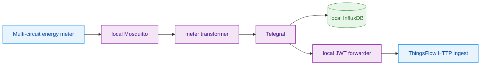

# Edge Gateway With Mosquitto And Telegraf

The local compose stack can run a small edge gateway profile:

```text
simulated/local devices -> edge-mosquitto -> edge-telegraf -> HTTP ingest -> NATS
```

This is useful for plants where devices publish to a local broker and a gateway
forwards the accepted telemetry to ThingsFlow.

## Run

Run only the edge gateway against a remote or cluster ThingsFlow endpoint:

```bash
EDGE_FLOW_CORE_URL=https://thingsflow.example.com \
EDGE_UPSTREAM_HTTP_URL=https://thingsflow.example.com/api/v1/telemetry \
docker compose -f docker/docker-compose-edge-gateway.yml --profile edge-gateway up -d
```

`EDGE_FLOW_CORE_URL` is the compose-level knob; the container itself reads `FLOW_CORE_URL`, which the compose file derives from it.

`docker-compose-nats.yml` remains the platform compose. The edge gateway is an
optional lab/field gateway overlay and should not be started unless this
scenario is being tested.

For a full local lab, the edge overlay can still be combined with
`docker-compose-nats.yml`, using the default local `flow-core` and `http-ingest`
service names.

The local simulated devices publish to:

```text
edge/devices/{device_name}/telemetry
```

Telegraf consumes those messages and forwards them to native ThingsFlow HTTP
ingest:

```text
POST /api/v1/telemetry
```

The upstream HTTP ingest request is authenticated with a short-lived Device JWT
issued to the gateway device and validated by Envoy with Flow Core JWKS. Local
devices do not receive ThingsFlow credentials in this compose profile.

## Security Model

- `edge-mosquitto` is a local edge broker and should remain on the edge network.
- `edge-telegraf-init` creates or reuses an edge provisioning profile and writes
  Telegraf config into an internal Docker volume owned by the Telegraf runtime
  user.
- `edge-telegraf` sends telemetry to a local JWT forwarder.
- The local forwarder injects the gateway Device JWT, refreshes it before
  expiry, retries once on `401`, and persists the renewed runtime file.
- Device JWTs are not printed in logs.
- For production, replace the local anonymous Mosquitto listener with mTLS,
  username/password, or a private network boundary.

Telegraf supports MQTT input and HTTP output with JSON serialization, so the
gateway keeps the telemetry path compact. The local forwarder is the small
control-plane bridge needed because Telegraf HTTP headers are static while the
Device JWT is intentionally short-lived.

## Real Energy Gateway Pattern

For a physical multi-circuit energy monitor, keep the edge project separate
from the ThingsFlow platform repository. The recommended flow is:



The meter transformer remains domain-specific: it decodes the meter's indexed
arrays, applies circuit names and scaling factors, and publishes a structured
message such as `edge/telemetry/energy/all` for local inspection. For
ThingsFlow forwarding, the transformer should publish one flat message per
circuit to a dedicated topic such as `edge/thingsflow/telemetry`. The edge-side
Telegraf configuration normalizes that topic into ThingsFlow's native HTTP
telemetry contract and sends it to the local JWT forwarder. The forwarder then
posts to `POST /api/v1/telemetry` with the gateway Device JWT.

The edge gateway may also run a local InfluxDB bucket for edge-side
inspection and short-term troubleshooting. This is not the authoritative
ThingsFlow historical store. The platform history remains GreptimeDB through
the NATS/Bento data plane; InfluxDB is local observability at the field site.
Telegraf writes to both outputs and filters duplicated string metadata from the
InfluxDB output, keeping circuit identity as tags.

Use one ThingsFlow gateway device for the edge site, for example
`Site Energy Monitor`, unless the pilot explicitly needs each circuit to
be provisioned as a first-class device. Because the historical telemetry table
stores one row per `device_id + telemetry_key + timestamp`, edge gateways that
send many circuits through one gateway JWT should prefix keys by circuit, for
example `main_total_active_power`, `refrigerator_energy_in_kwh`, and
`office_lighting_voltage`. This keeps the field deployment small while
preserving per-circuit history for dashboards, alarms, and analytics.

Do not rely on ThingsFlow core to understand meter-specific Telegraf tags. Keep
edge tags such as `circuit_name`, `circuit_index`, `location`, and
`meter_device_id` as local edge/Influx metadata, and send only telemetry values
to ThingsFlow. ThingsFlow should receive a clean payload shaped like:

```json
{
  "ts": 1780678800000,
  "values": {
    "main_total_active_power": 1234.5,
    "main_total_energy_in_kwh": 456.789,
    "main_total_voltage": 120.1,
    "main_total_current": 10.2
  }
}
```

The edge project should synchronize static meter metadata through the control
plane, not through telemetry: write identifiers such as `meter_device_id`,
`meter_model`, `circuit_count`, and `circuit_map` as device `SERVER_SCOPE`
attributes. The contract smoke should verify:

- the ThingsFlow device inventory contains only the real gateway device;
- telemetry keys equal `circuit_count * 5` measurement keys;
- metadata fields are absent from timeseries;
- meter metadata attributes are present in `SERVER_SCOPE`.
