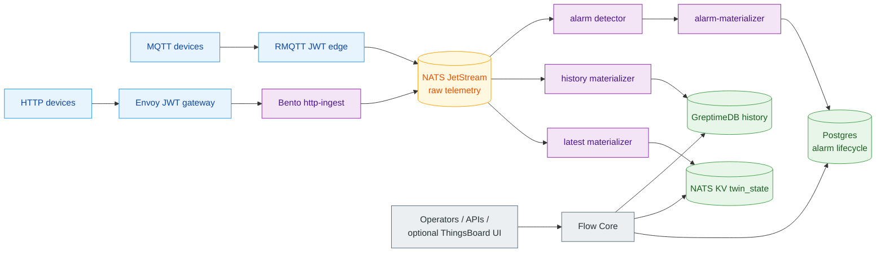
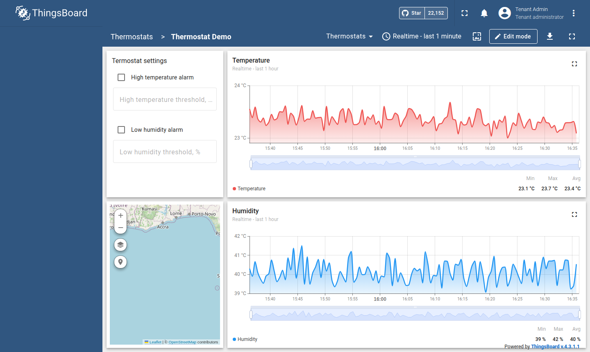

# ThingsFlow

Open industrial IoT middleware for event-driven telemetry, digital twins,
data-plane alarms, and optional ThingsBoard UI compatibility.

ThingsFlow follows the modular IoT middleware philosophy of projects such as
Mainflux: protocols, identity, message flow, storage, and management APIs have
clear boundaries. Its product shape is different. ThingsFlow keeps the useful
ThingsBoard operator experience, but replaces the heavy telemetry path with a
NATS-first data plane made from small OSS components.

## What Makes ThingsFlow Different

- **ThingsBoard UI without the ThingsBoard monolith.** The Angular UI can be
  used as a compatibility console, while Flow Core owns the API/control plane.
- **NATS as more than a broker.** JetStream is the event spine and NATS KV is
  the authoritative latest/twin hot-state store used by dashboard hydration.
- **Flow Core is outside telemetry ingest.** It manages users, tenants, devices,
  credentials, topology, dashboards, alarms API, audit, and compatibility reads.
- **Bento keeps the flow declarative.** HTTP normalization, latest writes,
  GreptimeDB history, and alarm-intent detection are handled with standard
  Bento pipelines instead of custom services per hop.
- **Postgres stays operational.** It stores metadata, topology, dashboards,
  alarm lifecycle, users, tenants, audit, and backups; it is not the hot latest
  telemetry sink.
- **GreptimeDB owns time-series history by default.** Historical telemetry,
  chart windows, analytics, and future ML feature extraction read from the
  time-series store. QuestDB remains an optional backend.

## Runtime In One Page

Live telemetry from the demo simulator, rendered by the optional ThingsBoard UI
over Flow Core APIs:

## Core Modules

| Module | Purpose |
|---|---|
| **Flow Core** | Go control plane and compatibility API. |
| **Data plane** | RMQTT, Envoy, Bento, NATS, NATS KV, GreptimeDB, and alarm materialization. |
| **Things** | Digital twin representation for devices and assets. |
| **ThingsBoard UI adapter** | Optional compatibility console over Flow Core APIs. |

## Documentation Map

Start with the platform shape:

- [Getting Started](GETTING_STARTED.md): local compose, Helm install, smoke
  tests, and default credentials.
- [Install](INSTALL.md): the full Kubernetes install path, production mode,
  secrets, and OIDC.
- [Architecture](ARCHITECTURE.md): component map, control/data-plane split,
  storage ownership, and scaling boundary.
- [Release](RELEASE.md): product identity, pilot gates, publication, and OSS
  release rules.

Understand the domain model:

- [Digital Twin](DIGITAL_TWIN.md): twin model, registry, topology, and twin API.

Follow the messaging path:

- [Data Plane](DATA_PLANE.md): MQTT/HTTP ingress, NATS subjects, Bento
  materializers, NATS KV latest state, GreptimeDB history, alarm intents,
  replay, DLQ, and lag checks.
- [Edge Gateway](EDGE_GATEWAY.md): running the field gateway against a remote
  ThingsFlow endpoint, and the multi-circuit metering pattern.

Operate and secure it:

- [API Reference](API_REFERENCE.md): OpenAPI contract, UI-independent APIs,
  provisioning, OIDC broker, and UI compatibility contract.
- [Device SDK](DEVICE_SDK.md): Python SDK for provisioning, MQTT/HTTP
  telemetry, and Device JWT renewal.
- [MQTT Device Auth](MQTT_DEVICE_AUTH.md): the device-side contract — getting
  a Device JWT, connecting over TLS, topics, ACLs, and refresh.
- [UI Contract Coverage](UI_CONTRACT_COVERAGE.md): how ThingsBoard UI
  compatibility is measured and enforced (373 endpoints, zero silent gaps).
- [Security](SECURITY.md): trust boundaries, key custody, and production
  checklist.
- [Operations](OPERATIONS.md): public access, logs, backups, observability,
  controlled pilot runbook, resource planning, and ThingsFlow vs ThingsBoard
  Classic benchmark methodology.

Validate a release:

- [Demo Profile](DEMO_PROFILE.md): dashboards, demo devices, topology, and the
  telemetry simulator.
- [Release](RELEASE.md): controlled industrial pilot gates, public artifact
  boundary, and publishing checklist.

## Current Status

ThingsFlow is an open-source release candidate for controlled industrial pilots.
Use [Release](RELEASE.md) as the release boundary before real customer or
industrial deployments.
